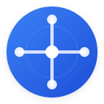

# 📚 NEXUS New Tab - Documentation Hub

**Complete documentation for NEXUS New Tab**

## 🗺️ Documentation Navigation

### 🚀 **Getting Started**
| Document | Description |
|----------|-------------|
| [📖 **Main Documentation**](index.md) | **START HERE** - Complete overview with screenshots |
| [⚡ Installation Guide](installation.md) | Step-by-step installation instructions |
| [📱 User Guide](user-guide.md) | Complete walkthrough of all features |
| [⌨️ Keyboard Shortcuts](keyboard-shortcuts.md) | All keyboard shortcuts and hotkeys |

### ✨ **Features Documentation**
| Feature | Guide |
|---------|-------|
| [🤖 AI Prediction](features/ai-prediction.md) | Machine learning tab prediction system |
| [🎨 Themes & Customization](features/themes.md) | Color themes and typography options |
| [📅 Smart Date Insights](features/smart-date.md) | 12 intelligent date features |
| [⏱️ Focus Timer](features/focus-timer.md) | 25-minute Pomodoro timer |
| [📝 Quick Notes](features/quick-notes.md) | Auto-save notepad functionality |
| [💬 Daily Quotes](features/daily-quotes.md) | Inspirational quote system |

### 🛠️ **Technical Documentation**
| Topic | Guide |
|-------|-------|
| [🏗️ Architecture](technical/architecture.md) | System design and code structure |
| [⚡ Performance](technical/performance.md) | Optimization strategies and benchmarks |
| [♿ Accessibility](technical/accessibility.md) | WCAG 2.1 AA compliance details |
| [🌐 Cross-Browser](technical/cross-browser.md) | Multi-browser compatibility |
| [🔒 Security](technical/security.md) | Privacy and security considerations |

### 👨‍💻 **Development**
| Document | Purpose |
|----------|---------|
| [🔧 Development Guide](development.md) | Local development setup |
| [📡 API Reference](api-reference.md) | Complete API documentation |
| [🚀 Deployment](DEPLOYMENT.md) | Build and release process |
| [🐛 Troubleshooting](troubleshooting.md) | Common issues and solutions |

## 🎯 Quick Links

| **For Users** | **For Developers** | **For Contributors** |
|:---:|:---:|:---:|
| [📖 Main Docs](index.md) | [🔧 Development](development.md) | [🤝 Contributing](../CONTRIBUTING.md) |
| [⚡ Install](installation.md) | [🏗️ Architecture](technical/architecture.md) | [🐛 Issues](https://github.com/hellomosaddiq/nexus-new-tab/issues) |
| [📱 User Guide](user-guide.md) | [📡 API Docs](api-reference.md) | [💬 Discussions](https://github.com/hellomosaddiq/nexus-new-tab/discussions) |

## 📊 Documentation Stats

- **📄 Total Pages**: 20+ comprehensive guides
- **🖼️ Screenshots**: 5 high-quality interface captures
- **⌨️ Shortcuts**: 7 keyboard shortcuts documented
- **🎨 Themes**: 9 color themes + 5 typography themes
- **📅 Features**: 12 smart date insights explained
- **🔧 APIs**: Complete technical reference

## 🆘 Need Help?

1. **📖 Start with** [Main Documentation](index.md) for overview with screenshots
2. **🔍 Search** the specific feature guides above
3. **🐛 Check** [Troubleshooting](troubleshooting.md) for common issues
4. **💬 Ask** in [GitHub Discussions](https://github.com/hellomosaddiq/nexus-new-tab/discussions)
5. **🚨 Report** bugs in [GitHub Issues](https://github.com/hellomosaddiq/nexus-new-tab/issues)

---

**📚 This documentation hub helps you navigate NEXUS's comprehensive guides**

[🏠 Back to Main Project](../README.md) • [📖 Main Documentation](index.md) • [⚡ Quick Install](installation.md)

